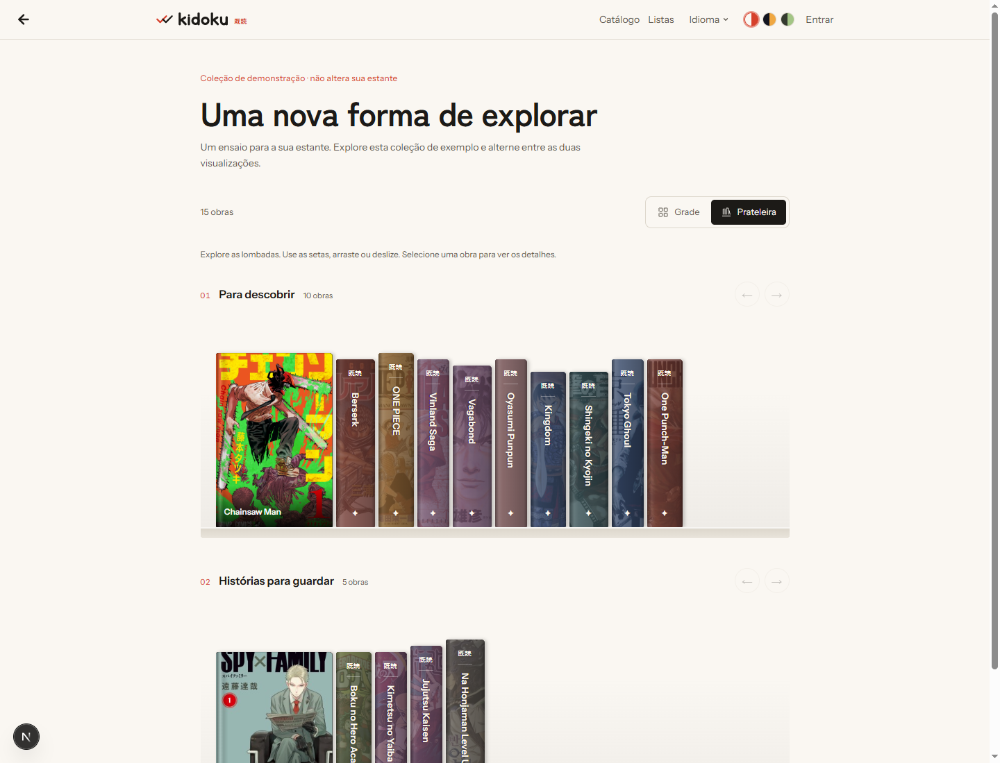

# Experimento de prateleiras — #182

## Objetivo

Avaliar a metáfora de livros físicos no Kidoku, com uma implementação em CSS
inspirada em Shelf Stories e na estante de jcarbonell.

## Escopo implementado

- Alternância Grade/Prateleira no catálogo e na estante. Grade continua sendo
  a visualização inicial; a escolha dura enquanto o componente está montado.
- Estante dividida por status, preservando filtros e a ordem da grade atual.
- Lombadas com título vertical, recorte da capa, paleta determinística por obra
  e alturas variadas. A primeira capa fica exposta; foco e hover revelam outras.
- Painel lateral reaproveita o card renderizado no servidor e suas ações.
- Rolagem por toque, arraste do mouse e botões; navegação entre obras com
  esquerda/direita/Home/End, abertura por Enter/Espaço, fechamento por Escape.
- Dialog nativo, ciclo de foco e retorno ao livro; confirmação de reset mantém
  Escape e ciclo de foco próprios. Movimento reduzido respeitado.
- Cinco idiomas e os três temas existentes. Cabeçalho pode quebrar linhas em
  telas estreitas para evitar overflow da página inteira.
- `/pt-BR/laboratorio/prateleira`: demonstração com 15 metadados públicos fixos,
  disponível somente em desenvolvimento. Não depende de API ou banco para
  listar as obras; as imagens continuam hospedadas no CDN do AniList.

## Decisões e limites

Sem biblioteca 3D, dependência nova, migration ou mudança de regra de negócio.
As cores são uma paleta estável com a capa sobreposta, não extração de cor
dominante. Quando a imagem falha, permanecem a cor e o título da lombada.
Filtros e ordenação do catálogo continuam existentes; filtro de gênero e nova
ordenação na estante não fazem parte deste primeiro experimento.

## Validação

- 523 testes existentes passaram também no worktree isolado.
- TypeScript e ESLint passaram.
- Chromium: alternância das duas vistas, 15 itens, navegação por setas, Enter,
  ciclo de Tab, Escape, retorno de foco, painel em viewport de 390px, idiomas
  en/es/fr/de, movimento reduzido; sem erros de runtime.
- Inspeção visual em Sumi, Noturno e Matcha; celular emulado, ainda sem teste
  em aparelho físico.
- Build de produção sem DATABASE_URL tentou baixar as fontes Google já usadas
  pelo projeto e ficou repetindo `socket hang up`. Interrompido por falha de
  rede; o build de produção ainda precisa ser concluído.
- Uma segunda tentativa com o compilador padrão e dependências próprias também
  ficou em compilação sem concluir. Não há build de produção validado.

## Ambiente desta sessão

Outra tarefa trocou a branch do workspace principal durante a implementação.
O redesign foi isolado em `.next/issue-182/worktree`, na branch
`desenvNovoDesignCatalogo`. O servidor isolado na porta 3001 não concluiu a
compilação e foi encerrado; a validação visual acima ocorreu no servidor
original antes do isolamento. Para avaliar, abrir a branch em um checkout
normal, iniciar `pnpm dev` e visitar `/pt-BR/laboratorio/prateleira`.

## Referências

- https://github.com/ArthurM4rtins/mymangatracker/issues/182
- https://shelf-stories.linusekenstam.chatgpt.site/
- https://www.jcarbonell.com/bookshelf
